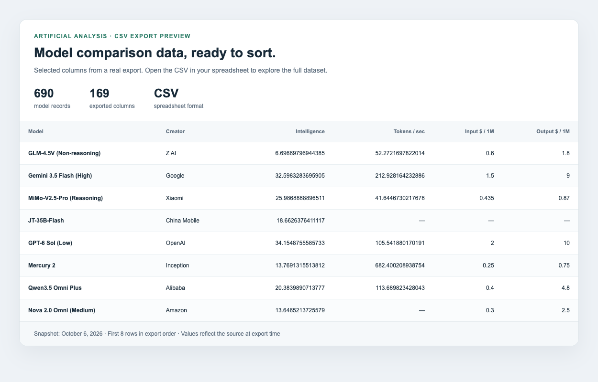

# Artificial Analysis Scraper: LLM Benchmarks to CSV

A Python scraper that exports [Artificial Analysis](https://artificialanalysis.ai/models) LLM benchmarks, model pricing, inference speed, and provider leaderboards to CSV. Compare large language models in Excel, Google Sheets, or a Python data analysis workflow.

This is a fork of [deyil/artificial-analysis-leaderboards-scraper](https://github.com/deyil/artificial-analysis-leaderboards-scraper). It adds full model-dataset extraction, readable CSV headings, and browser installation inside the project folder.



*Preview rendered from an October 6, 2026 export: 690 models and 169 columns. The screenshot shows selected columns and rows, not a bundled application interface. Counts and fields change with the source data.*

## What you can export

- **LLM benchmark results:** intelligence scores and available evaluations such as GPQA Diamond, Humanity's Last Exam, and SciCode.
- **Model pricing and inference performance:** input and output token prices, output speed, response times, and context windows when present in the source data.
- **Model metadata:** creators, release dates, reasoning and open-weight flags, plus additional fields from the complete dataset.
- **API provider leaderboards:** rows and columns from browser-rendered provider comparison tables.

Use the CSV to filter models by price, compare benchmark scores, or analyze inference performance. The tool exports source values; it does not run benchmarks or measure providers itself.

## Installation

Use Python 3.11 or 3.12. Run these commands in a terminal:

```bash
git clone https://github.com/prestonlogan/artificial-analysis-leaderboards-scraper.git
cd artificial-analysis-leaderboards-scraper
python3 -m venv .venv
source .venv/bin/activate
python -m pip install -r requirements.txt
```

On Windows, activate the environment with `.venv\Scripts\activate` instead.

The default model export downloads the site's model data directly. For provider leaderboard pages that need browser rendering, install Chromium:

```bash
python src/main.py --install-browser
```

The installer and scraper use `.browsers/` in this project by default. To choose another location, set `PLAYWRIGHT_BROWSERS_PATH` before both installation and execution. The browser and Python environment are excluded from Git.

## Export LLM benchmarks to CSV

From the project folder, with the environment activated:

```bash
python src/main.py
```

The default configuration exports the model dataset to `data/leaderboard_YYYY-MM-DDTHH-MM-SS.csv`. Logs are saved to `logs/scraper.log`.

Check for `Leaderboard scraping process completed successfully` in the terminal and a new CSV in `data/`. A process exit code alone does not confirm an export; some error paths log a failure and return without writing a file.

## Export API provider leaderboards

Edit `target_url` in `config.yaml`, or override it for one run:

```bash
TARGET_URL="https://artificialanalysis.ai/leaderboards/providers/prompt-options/single/medium_coding?deprecation=all" python src/main.py
```

For `/models`, the scraper reads the complete model dataset carried by the page, including fields that are not visible in its table. URL model-selection filters do not limit this export. Nested fields become columns; lists remain JSON strings within CSV cells. Missing values are left blank.

For provider leaderboard pages, the scraper uses headless Chromium and extracts the rendered table. Those exports follow the table's available rows and headings.

## Configure output

The checked-in `config.yaml` uses these settings:

```yaml
target_url: "https://artificialanalysis.ai/models"
output_csv_path: "data/leaderboard.csv"
output_add_timestamp: true
output_localize_numbers: false
output_locale: "el_GR"
```

| Setting | Environment override | Behavior |
| --- | --- | --- |
| `target_url` | `TARGET_URL` | Page to export. |
| `output_csv_path` | `OUTPUT_PATH` | Destination file or directory. |
| `output_add_timestamp` | `OUTPUT_ADD_TIMESTAMP` | Adds a timestamp to the filename. Set to `false` to reuse the same path. |
| `output_localize_numbers` | `OUTPUT_LOCALIZE_NUMBERS` | Formats decimal values using `output_locale` when enabled. |
| `output_locale` | `OUTPUT_LOCALE` | Babel locale for decimal formatting; ignored when localization is disabled. |

For a stable filename:

```bash
OUTPUT_ADD_TIMESTAMP=false python src/main.py
```

This writes `data/leaderboard.csv` and replaces an existing file at that path. Keep timestamped output enabled to retain separate exports.

## Run in GitHub Actions

In your fork, enable Actions if prompted. Open **Actions → Run Leaderboard Scraper → Run workflow**. You can supply a provider leaderboard URL or leave the input blank to use `config.yaml`.

The workflow installs dependencies, runs the scraper, and uploads `leaderboard-csv` as a downloadable artifact. Generated CSV files are not committed to the repository.

## Troubleshooting

If the browser executable is missing, run `python src/main.py --install-browser` with the same environment and browser-path setting used by the scraper.

If fetching or parsing fails, inspect `logs/scraper.log`. The model export depends on the site's current data-manifest format; provider exports depend on its HTML structure. A site change can require a scraper update.

## Development

Install the existing test dependencies and run the suite:

```bash
python -m pip install -r requirements-dev.txt
python -m pytest -q
```

See [the architecture notes](specs/architecture.md) for the extraction flow. Local exports, logs, browser downloads, environments, and caches are excluded by `.gitignore`.

## Attribution and license

Based on [deyil's original project](https://github.com/deyil/artificial-analysis-leaderboards-scraper). The original history is retained in this fork. Source code is distributed under [GNU GPL version 3](LICENSE).

Model data comes from Artificial Analysis. The code license does not grant rights to the source dataset. This project is not affiliated with Artificial Analysis.
